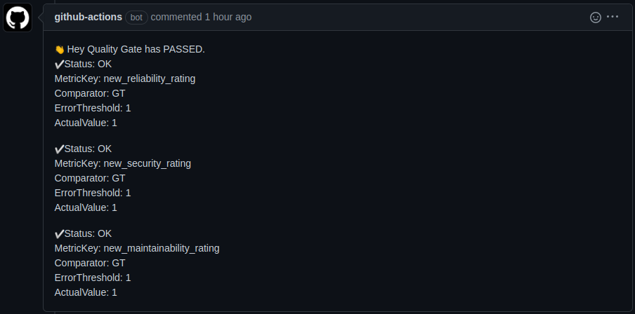
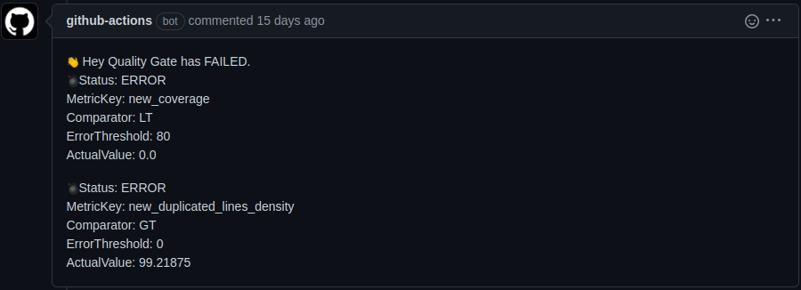

# SonarQube Pull Request Comment

Ensure your code meets quality standards before releasing or deploying new features by using [SonarQube](https://www.sonarqube.org/) to check the Quality Gate of your code.


SonarQube is a leading product for Continuous Code Quality and Code Security. It supports many popular programming languages, including Java, JavaScript, TypeScript, C#, Python, C, C++, and many more.

## Requirements

- **GitHub Token**: This secret is automatically created by GitHub. You just need to reference it in your workflow as `secrets.GITHUB_TOKEN`.
  and add this code block inside your pipeline 
  ```bash
      permissions: # permission to comment a PR
        contents: read
        pull-requests: write
  ```

- **Code Analysis**: A previous step in your workflow must have executed an analysis on your code using SonarQube.

For more information on how to analyze your code, refer to the [SonarQube GitHub Integration Documentation](https://docs.sonarqube.org/latest/analysis/github-integration/).

## Usage

Below is an example of a typical GitHub Actions workflow YAML file that incorporates SonarQube analysis:

```yaml
name: Sonar Scan

on:
  # Trigger analysis when pushing to the main branch or when creating/updating pull requests.
  push:
    branches:
      - main
  pull_request:
    types: [opened, synchronize, reopened]

jobs:
  sonarqube:
    runs-on: ubuntu-latest
    permissions: # permission to comment a PR
      contents: read
      pull-requests: write
    steps:
      - uses: actions/checkout@v2
        with:
          # Disabling shallow clone is recommended for improving the relevancy of reporting.
          fetch-depth: 0

      # Triggering SonarQube analysis; the results are required for the Quality Gate check.
      - name: SonarQube Scan
        uses: sonarsource/sonarqube-scan-action@master
        env:
          SONAR_TOKEN: ${{ secrets.SONAR_TOKEN }}
          SONAR_HOST_URL: ${{ secrets.SONAR_HOST_URL }}

      # Check the Quality Gate status.
      - name: SonarQube Quality Gate check
        id: sonarqube-quality-gate-check
        uses: sonarsource/sonarqube-quality-gate-action@master
        # Enforce a timeout to fail the step after a specific time.
        timeout-minutes: 5
        env:
          SONAR_TOKEN: ${{ secrets.SONAR_TOKEN }}
          SONAR_HOST_URL: ${{ secrets.SONAR_HOST_URL }} #OPTIONAL

      - name: SonarQube Pull Request Comment
        if: always()
        uses: campos-pay/sonarqube-pr-comment@main
        with:
          sonar_token: ${{ secrets.SONAR_TOKEN }}
          sonar_host_url: ${{ secrets.SONAR_HOST_URL }}
          sonar_projectkey: ${{ github.event.repository.name }}
          github-token: ${{ secrets.GITHUB_TOKEN }}
          repo_name: ${{ github.repository }}
          pr_number: ${{ github.event.pull_request.number }}
          github_api_base_url: "https://ourselfhostedgithub.com/api/v3" # OPTIONAL but useful if you are NOT using github.com
```
## Example Result
For result Ok 



For failed result


